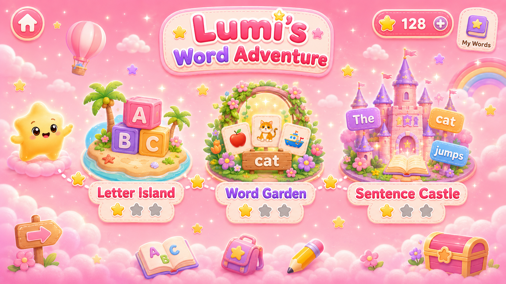
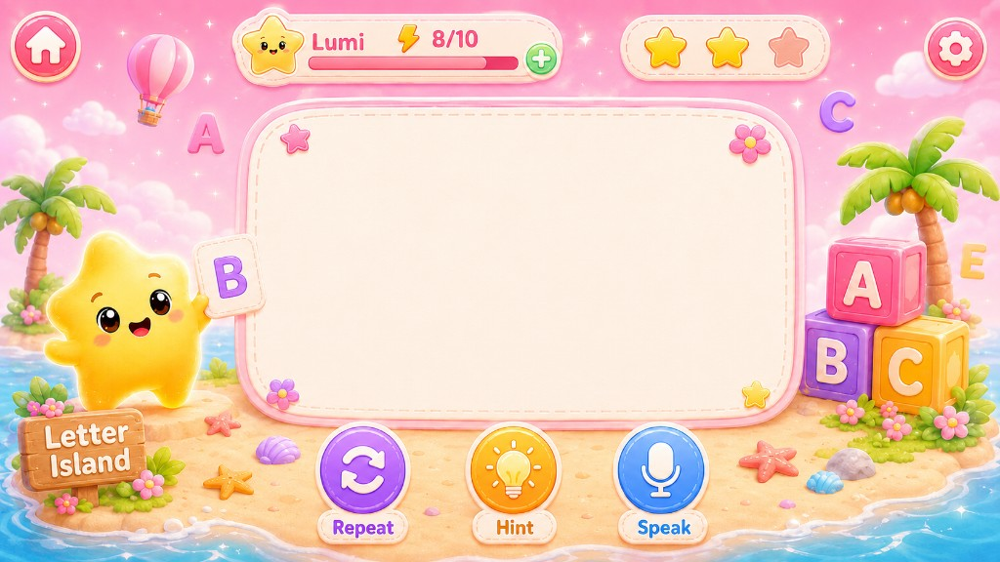
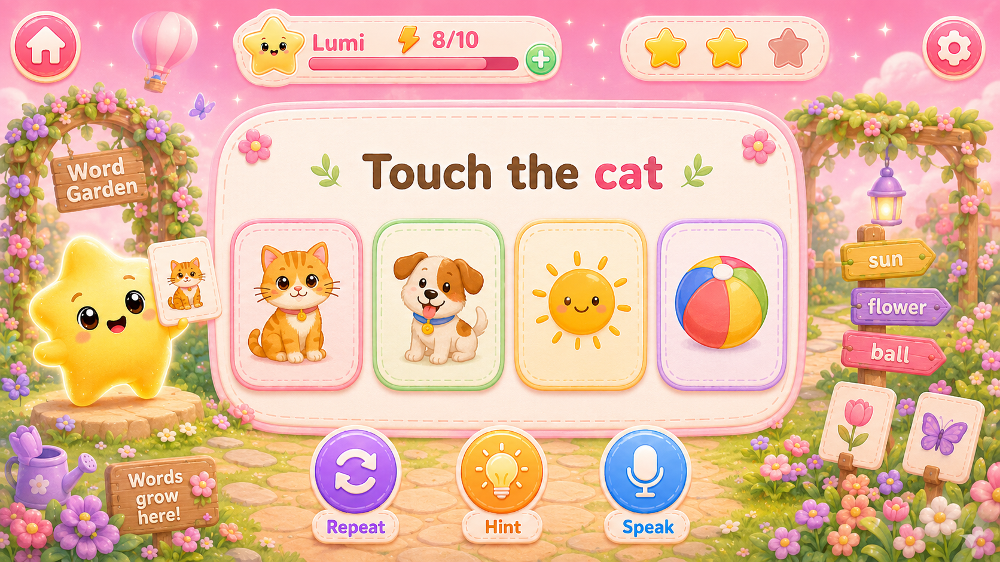
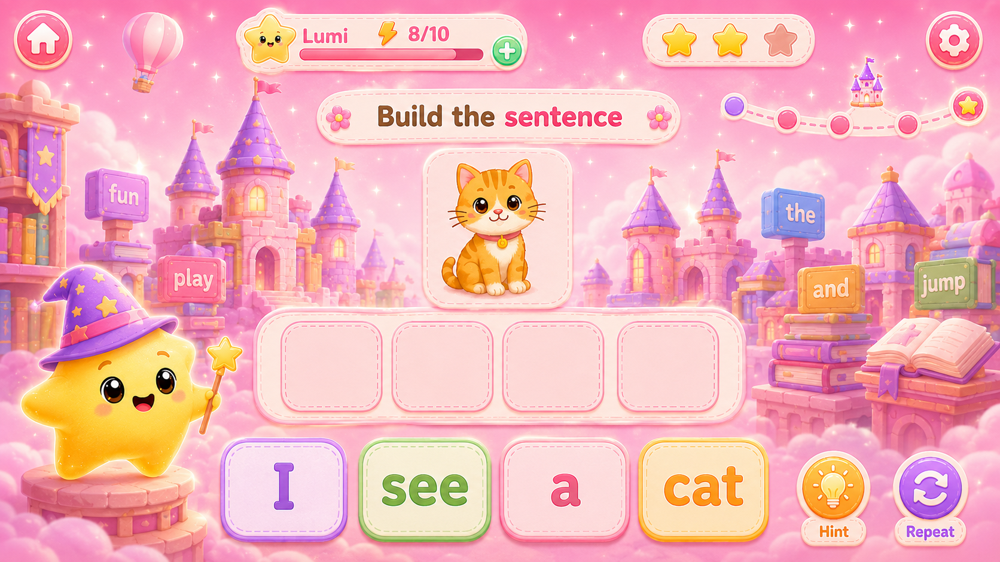
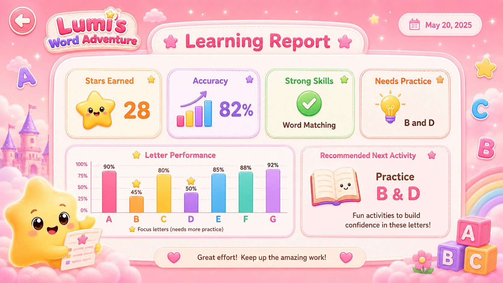
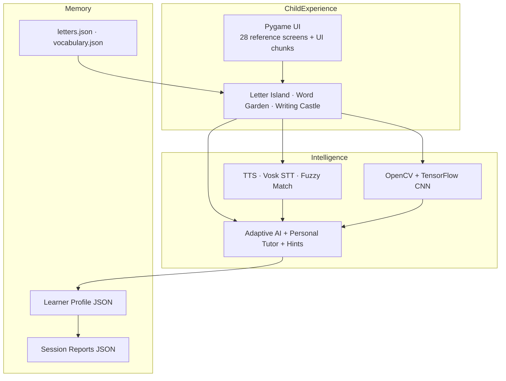
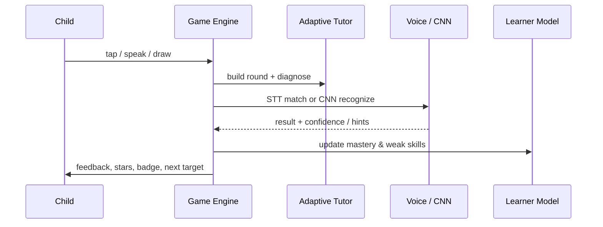

# Lumi's Word Adventure

### An adaptive, offline literacy companion for children aged 4–6

**Lumi** is the brand, the mascot, and the guiding presence inside the game — a warm AI tutor that helps young children master letters, words, speech, and handwriting through a magical, baby-pink adventure.

> **Tap. Speak. Write. Grow.**  
> Personalized early literacy at home — no internet required.

[](https://youtu.be/8Ndz0iaTTk0?si=RJfJDy-n00pdbJ15)
[](https://www.python.org/)
[](LICENSE)
[](#privacy--offline-first)
[](#aiml-systems)

---

## Watch the Demo

**Full walkthrough:** [https://youtu.be/8Ndz0iaTTk0](https://youtu.be/8Ndz0iaTTk0?si=RJfJDy-n00pdbJ15)

<p align="center">
  
</p>

<p align="center"><em>Three learning worlds on one map — Letter Island, Word Garden, and Writing Castle.</em></p>

---

## The Problem

Early literacy is the foundation of everything that follows in school — yet at home, most tools fall short:

| Gap | What families experience today |
|-----|--------------------------------|
| **One-size-fits-all drills** | Apps ignore that every child confuses different letters (especially **B/D**, **M/W**) |
| **Always-online dependency** | Many “AI tutors” need cloud APIs — fragile on home Wi‑Fi, costly, and privacy-heavy |
| **Punitive scoring** | Wrong answers feel like failure; young kids shut down |
| **Single modality** | Tap-only quizzes miss speaking and handwriting — the skills that actually stick |
| **No parent insight** | Caregivers get streaks and coins, not *what to practice next* |

**Lumi's Word Adventure** was built to close those gaps for the **home market**: a beautiful, private, adaptive literacy adventure parents can trust on a laptop or desktop — fully offline.

---

## The Solution

**Lumi's Word Adventure** is a local desktop educational game (Python + Pygame) that combines:

1. **Screenshot-faithful magical UI** — 28 designer reference screens as the visual source of truth  
2. **Rule-based adaptive AI tutor** — mastery tracking, confusion diagnosis, spaced review, escalating hints  
3. **Multimodal practice** — tap, speak, and write  
4. **CNN handwriting recognition** — real computer vision in **Writing Castle**  
5. **Offline voice** — TTS + Vosk speech recognition with fuzzy matching  
6. **Teacher / parent session reports** — accuracy, weak skills, and a recommended next activity  

Lumi never subtracts stars. Progress is celebrated. Mistakes become gentle, targeted practice.

---

## Product Snapshot

| | |
|---|---|
| **Product** | Lumi's Word Adventure |
| **Who it's for** | Children **ages 4–6**, with parents & caregivers as secondary users |
| **Primary market** | **Home** literacy practice (families, after-school, weekend learning) |
| **Platform** | Desktop / laptop (1280×720 @ 60 FPS, Pygame) |
| **Connectivity** | **Offline-first** — no backend, no accounts, no cloud AI |
| **Core loop** | Learn → adapt → speak / write → report → practice weak skills |

---

## Learning Worlds

### 1. Letter Island
A–Z letter recognition with adaptive target selection, 4-card choices, voice challenges, and dedicated **B/D remediation** when confusion patterns appear.

<p align="center">
  
</p>

### 2. Word Garden
Visual word recognition with object tiles (sun, fish, apple, bird, and more), word mastery tracking, and pronunciation practice. Unlocks after Letter Island progress.

<p align="center">
  
</p>

### 3. Writing Castle *(flagship ML world)*
Children draw letters and words with the mouse. Snapshots are preprocessed with **OpenCV**, classified by a **TensorFlow CNN** (`letter_classifier.h5`, 26 classes), then refined with geometric disambiguation and dictionary-aware word hints.

This is the deepest machine-learning surface in Lumi — not a toy OCR stub, but a full **draw → preprocess → predict → disambiguate → feedback** pipeline.

<p align="center">
  
</p>

<p align="center"><em>Writing Castle — CNN-powered handwriting practice (letters → words).</em></p>

### Parent / Teacher Report
After a session, Lumi surfaces stars, accuracy, strong skills, needs-practice areas, and a concrete next activity — also exported as local JSON.

<p align="center">
  
</p>

---

## AI/ML Systems

Lumi’s intelligence is **fully on-device**. No LLM API keys. No telemetry. Every decision can run on a family computer with the mic muted if needed.

### 1. Writing Castle — CNN Handwriting Recognition

| Stage | What happens |
|-------|----------------|
| **Capture** | Child draws on a Pygame canvas → snapshot PNG |
| **Vision preprocess** | OpenCV: grayscale, region extraction, resize/pad to **28×28**, orientation normalize |
| **CNN inference** | TensorFlow / tf-keras loads `writing_recognition/cnn_model/letter_classifier.h5` (26 A–Z classes; digit model as fallback) |
| **Top-k + confidence** | Top-5 predictions returned with probabilities |
| **Smart disambiguation** | Geometric hints (crossbars, top/bottom bars, mirror pairs like B/D) refine confusable letters |
| **Word mode** | Multi-letter regions + dictionary / Levenshtein-aware matching for vocabulary words |
| **Curriculum** | Letters first, then Word Garden vocabulary (`engine/writing_progression.py`) |

**Why it matters for the product:** handwriting is the missing modality in most early-literacy apps. Writing Castle turns “I can tap A” into “I can *form* A” — and the model gives Lumi a signal to coach the child in real time.

**Key paths:**
- `lumi_word_adventure/writing_recognition/process_image.py`
- `lumi_word_adventure/writing_recognition/hints.py`
- `lumi_word_adventure/writing_recognition/runner.py`
- `lumi_word_adventure/writing_recognition/cnn_model/letter_classifier.h5`

---

### 2. Adaptive Tutoring Engine (Personal AI Tutor)

A deterministic, explainable tutor — ideal for children, parents, and demos:

- **Letter mastery model** — per-letter attempts, first-try bonuses, hint penalties, mastery threshold **0.80**, consecutive-correct graduation  
- **Confusion groups** — e.g. B↔D/P/R, M↔W/N, C↔G/O — used to diagnose *why* a mistake happened  
- **Spaced review** — inserts review every few curriculum letters based on weak mastery  
- **Dynamic difficulty** — streaks raise/lower difficulty within safe bounds  
- **Practice recommendations** — routes to B/D practice, weak words, or world map  
- **Escalating hint engine** — phonics, shape, and mouth cues that grow gentler help without spoiling the answer  

**Key paths:**
- `lumi_word_adventure/engine/adaptive_ai.py`
- `lumi_word_adventure/engine/personal_tutor.py`
- `lumi_word_adventure/engine/hint_engine.py`

---

### 3. Offline Voice Intelligence

| Capability | Stack |
|------------|--------|
| **Text-to-speech** | `pyttsx3` — gentle female voice, threaded worker, tone presets (instruct / celebrate / soothe) |
| **Speech-to-text** | **Vosk** offline model (`models/vosk-model-small-en-us-0.15`) with SpeechRecognition fallback |
| **Answer matching** | RapidFuzz (~80% threshold) + phonetic letter aliases (“gee” → G) |
| **Graceful degradation** | Full tap-only play if mic/voice is unavailable |

Voice is treated as a first-class learning channel: Lumi *speaks* prompts and *listens* for letters and words — then forgives accent and soft pronunciation the way a good kindergarten teacher would.

**Key paths:**
- `lumi_word_adventure/voice/text_to_speech.py`
- `lumi_word_adventure/voice/speech_to_text.py`
- `lumi_word_adventure/voice/voice_checker.py`

---

### 4. Learner Model & Session Intelligence

Local JSON profiles track mastery, weak letters/words, badges, points, streaks, writing progress, and attempt history. Session reports compute:

- Stars earned & accuracy  
- Strong skill vs needs practice  
- Recommended next screen/activity  
- Export: `reports/session_reports/session_report_<timestamp>.json`

**Key paths:**
- `lumi_word_adventure/engine/learner_model.py` (and related profile loaders)
- `lumi_word_adventure/reports/report_generator.py`
- `lumi_word_adventure/profiles/player_1.json`

---

### 5. Pedagogy as Product Logic

- **Non-punitive scoring** — 3 / 2 / 1 stars by hint usage; wrong answers never subtract stars  
- **Points & ranks** — Little Sprout → Lumi Champion  
- **Badges** — milestones such as Word Explorer, Brave Speaker, B and D Master  
- **Child-safe UX** — short sessions, celebration screens, offline continue path  

---

## System Architecture



### Typical round



**Central orchestrator:** `lumi_word_adventure/engine/game_engine.py`  
**Visual contract:** reference PNGs in `reference_interfaces/` + hitboxes in `screen_specs.json` — code overlays interaction; it does not redesign the art.

---

## Tech Stack

| Layer | Technology |
|-------|------------|
| Language | Python **3.11+** |
| Game / UI | **Pygame** (1280×720, 60 FPS), Pillow |
| Adaptive AI | Custom mastery & confusion engine (offline, deterministic) |
| Handwriting ML | **OpenCV** + **TensorFlow / tf-keras** CNN |
| Speech | **Vosk** (offline STT), pyttsx3 (TTS), RapidFuzz |
| Audio I/O | sounddevice, PyAudio, pygame.mixer |
| Data | Local JSON (profiles, curriculum, reports) — no database |
| Testing | **pytest** (~39 test modules) |
| Packaging mindset | Desktop-local; PyInstaller-ready architecture |

---

## Features at a Glance

- Magical onboarding: splash → welcome → profile → how-to-play → world map  
- Letter Island with adaptive curriculum & B/D practice  
- Word Garden with object tiles & word mastery  
- **Writing Castle with CNN letter/word recognition**  
- Voice challenges (letters & words) with offline STT  
- Badges, points, ranks, celebration screens  
- Settings: music, voice, difficulty, mic test, reset progress  
- Practice weak skills shortcut  
- Teacher/parent report + JSON export  
- Offline continue when voice is unavailable  
- Debug tooling: hitbox visualization, chunk preprocess, screenshot capture  

---

## Business Opportunity — Home Market

Lumi is positioned for **families**, not classrooms first.

### Why home wins

- Parents want **safe, screen-time-with-purpose** tools for ages 4–6  
- Home Wi‑Fi is unreliable for cloud tutors; **offline** is a feature, not a compromise  
- Privacy matters when a child’s voice and handwriting are involved — Lumi keeps data **on the device**  
- Caregivers need a **report they can act on tonight**, not a vanity dashboard  

### Product wedge

1. **Delight** — magical brand world kids ask to reopen  
2. **Adaptation** — Lumi notices B/D confusion and intervenes  
3. **Multimodal skill** — tap + speak + **write with CNN**  
4. **Trust** — MIT-licensed openness + offline privacy  

### Go-to-market direction (vision)

| Stage | Focus |
|-------|--------|
| Near-term | Polished desktop demo for homes; word-of-mouth via parents & portfolio reach |
| Mid-term | Packaged installers, more handwriting vocabulary, multi-child profiles |
| Longer-term | Optional parent companion (still privacy-first), curriculum packs, localized languages |

> Lumi’s ambition is simple: become the literacy companion families open after dinner — adaptive like a tutor, playful like a game, private like a notebook.

---

## Privacy & Offline-First

- No accounts, no cloud backend in this version  
- Profiles and reports stay as local JSON  
- Speech recognition defaults to **on-device Vosk**  
- Handwriting inference runs **locally** via TensorFlow  
- Mic optional — tap-only path always available  

---

## Getting Started

### Prerequisites

- Python **3.11+**
- A graphical desktop session (the game opens a 1280×720 window)
- On Linux, PortAudio for microphone support:

```bash
sudo apt-get install portaudio19-dev
```

### Install

```bash
git clone <your-repo-url>
cd Lumi
python -m venv myvenv
source myvenv/bin/activate   # Windows: myvenv\Scripts\activate
pip install -r lumi_word_adventure/requirements.txt
```

> Use `lumi_word_adventure/requirements.txt` (includes TensorFlow, OpenCV, sounddevice, etc.). The root `requirements.txt` is a lighter subset.

### Run

```bash
python main.py
```

Or:

```bash
cd lumi_word_adventure
python main.py
```

### Optional environment variables

| Variable | Purpose |
|----------|---------|
| `VOSK_MODEL_PATH` | Override path to the Vosk model |
| `LUMI_WRITING_PYTHON` | Python executable for handwriting TF subprocess |
| `LUMI_SKIP_PREWARM` | Skip model warm-up (useful in tests) |
| `SDL_VIDEODRIVER=dummy` | Headless testing |

### Tests

```bash
cd lumi_word_adventure
pytest tests/ -q
```

### Demo path (great for walkthroughs)

Welcome → Profile → Main Menu → How to Play → World Map → **Letter Island** → (optional B/D practice) → **Word Garden** → voice challenge → **Writing Castle** → Badge / Progress → Practice Weak Skills → **Teacher Report** → End Session  

**Video:** [Watch on YouTube](https://youtu.be/8Ndz0iaTTk0?si=RJfJDy-n00pdbJ15)

---

## Repository Structure

```
Lumi/
├── main.py                          # Root launcher
├── README.md                        # You are here
├── LICENSE                          # MIT
├── screen_specs.json                # Hitboxes & purposes for 28 screens
├── reference_interfaces/            # Designer full-screen backgrounds
├── models/vosk-model-small-en-us-0.15/  # Offline STT model
└── lumi_word_adventure/             # Application package
    ├── main.py · config.py · data_loader.py
    ├── engine/                      # Game loop, adaptive AI, scoring, progression
    ├── ui/                          # Screens, overlays, chunk compositor
    ├── voice/                       # TTS, STT, fuzzy answer checking
    ├── writing_recognition/         # OpenCV + CNN handwriting pipeline
    ├── reports/                     # Report generator + session JSON exports
    ├── data/                        # letters, vocabulary, defaults
    ├── profiles/                    # Local learner profiles
    ├── assets/                      # UI chunks, sounds, fonts
    ├── tools/ · scripts/            # Asset & content tooling
    └── tests/                       # pytest suite
```

---

## Engineering Highlights (for recruiters & collaborators)

- **Screenshot-driven UI contract** — product design stays pixel-faithful while logic stays flexible  
- **Explainable adaptive AI** — mastery scores and confusion maps you can demo live in the console  
- **Production-minded ML integration** — lazy model load, warm-up, subprocess fallback, env overrides  
- **Resilient voice stack** — offline-first with fallbacks; audio ducking during TTS/mic  
- **Large orchestrated game engine** with modular tutor, scoring, reports, and writing progression  
- **Broad automated tests** covering AI, scoring, voice safety, writing, and reports  

---

## Team

| Role | Name |
|------|------|
| **Team Lead** | Bilal |
| Engineer | Sanusi Muhammad Sani |
| Engineer | Yusuf Sani Muhammad |
| Engineer | Khelef Mohammed Mussa |
| Engineer | Hussein Ajmi Badu |

Built with care for children — and for the parents who want learning that feels like magic.

---

## License

This project is released under the **MIT License**. See [LICENSE](LICENSE).

---

## Contact & Opportunities

If you’re building **EdTech**, **child-safe AI**, **offline ML products**, or hiring engineers who ship end-to-end systems (UI + adaptive logic + CNN + voice), I’d love to connect.

- **Demo:** [YouTube walkthrough](https://youtu.be/8Ndz0iaTTk0?si=RJfJDy-n00pdbJ15)  
- **This repository** — clone, run `python main.py`, and explore Writing Castle  

---

<p align="center">
  <strong>Lumi's Word Adventure</strong><br/>
  <em>Where every child meets a tutor who never gives up on them.</em>
</p>
